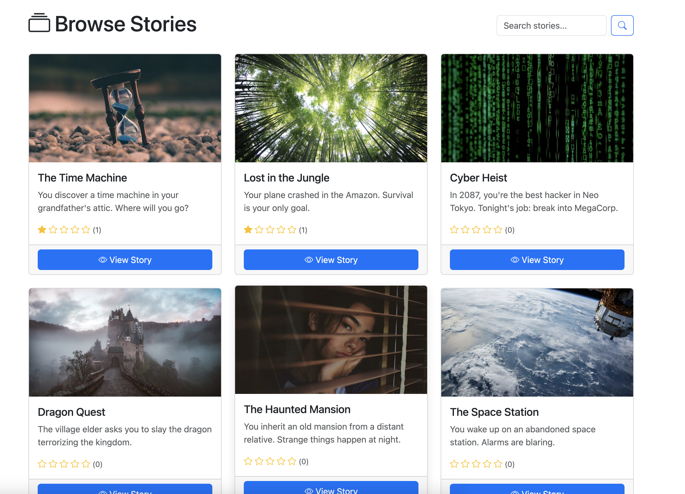

# NAHB - Not Another Hero's Book

An interactive storytelling platform inspired by "Choose Your Own Adventure" books.

##  Features

- **Interactive Stories** - Make choices that affect the story outcome
- **Multiple Endings** - Discover different paths and endings
- **Dice Rolls** - Some choices require luck (roll 1-6)
- **Auto-Save** - Progress saved automatically
- **Story Visualization** - See the story tree with D3.js
- **Community** - Rate, comment, and report stories
- **Role-Based Access** - Reader, Author, and Admin roles

## 🏗️ Architecture

Two-tier microservices architecture:

| Component | Technology | Purpose |
|-----------|------------|---------|
| **Flask API** | Flask 3.x | Story content storage (REST API) |
| **Django App** | Django 5.x | User experience, auth, gameplay |
| **Database** | SQLite | Data persistence |
| **Frontend** | Bootstrap 5 | Responsive UI |
| **Visualization** | D3.js | Story tree graphs |

##  Design Patterns

1. **Singleton** - FlaskAPIClient (single API connection)
2. **Factory** - StoryFactory (story creation with validation)
3. **Mediator** - GameMediator (coordinates gameplay components)
4. **Memento** - GameStateMemento (save/restore game state)

##  Quick Start

### Prerequisites
- Python 3.9+
- pip

### Setup
```bash
# Clone the repository
git clone https://github.com/Evelynval-w/Django-Flask-Finals.git
cd Django-Flask-Finals

# Setup Flask API
cd flask_api
python -m venv venv
source venv/bin/activate  # Windows: venv\Scripts\activate
pip install -r requirements.txt
flask db upgrade
flask run &

# Setup Django App (new terminal)
cd ../django_app
source ../flask_api/venv/bin/activate
pip install -r requirements.txt
python manage.py migrate
python manage.py create_test_users
python manage.py runserver
```

### Access the Application
- **Web App:** http://localhost:8000
- **Flask API:** http://localhost:5000

## 👤 Test Accounts

| Role | Username | Password |
|------|----------|----------|
| Admin | admin | Admin123! |
| Author | author1 | Author123! |
| Author | author2 | Author123! |
| Reader | reader1 | Reader123! |

## 📸 Screenshots

### Browse Stories


### Story Detail with Ratings


### Gameplay


### Dice Roll Mechanic


### Story Tree Visualization


### Author Dashboard


### Create Story


### Create Page with Choices


### Login Page


### About Page


### Help Page


## 📁 Project Structure
```
Django-Flask-Finals/
├── flask_api/                 # REST API for story content
│   ├── app/
│   │   ├── models/            # Story, Page, Choice
│   │   ├── routes/            # API endpoints
│   │   └── middleware/        # API key auth
│   └── requirements.txt
├── django_app/                # Web application
│   ├── accounts/              # User management
│   ├── stories/               # Story browsing
│   ├── author/                # Author tools
│   ├── gameplay/              # Game engine
│   ├── community/             # Ratings, comments
│   ├── moderation/            # Admin tools
│   ├── core/                  # Design patterns
│   │   └── services/
│   │       ├── api_client.py      # Singleton
│   │       ├── story_factory.py   # Factory
│   │       ├── game_mediator.py   # Mediator
│   │       └── game_memento.py    # Memento
│   ├── static/                # CSS, JS
│   └── templates/             # HTML templates
├── docs/
│   └── screenshots/           # Application screenshots
└── README.md
```

## 🔌 API Endpoints

### Public (No Auth)
- `GET /stories?status=published` - List published stories
- `GET /stories/<id>` - Get story details
- `GET /stories/<id>/tree` - Get story tree for visualization
- `GET /pages/<id>` - Get page content

### Protected (X-API-KEY Required)
- `POST /stories` - Create story
- `PUT /stories/<id>` - Update story
- `DELETE /stories/<id>` - Delete story
- `POST /stories/<id>/pages` - Add page
- `POST /pages/<id>/choices` - Add choice

## 🧪 Running Tests
```bash
# Flask tests
cd flask_api
pytest

# Django tests
cd django_app
python manage.py test
```

## 📝 License

MIT License

---

*Created for Advanced Web Development Course - February 2026*
